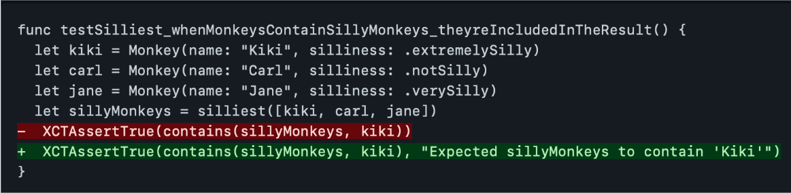
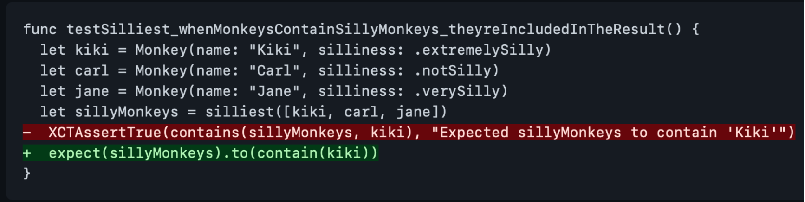
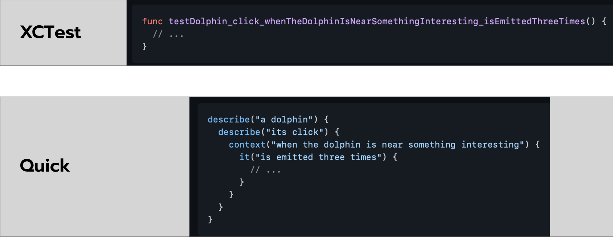

#  Improving tests readability with Quick and Nimble

## How to improve failing message in XCTest
All the XCTFramework methods accepts a last parameter that is a custom message

## How to improve it using Quick
The code itself is self explanatory, not needing additional arguments

## Test names
Structuring it hierarchically using Quick

## Examples in this Repo
In the [Quick/Nimble tests file](Tests/CarSafetySpec.swift) and in the [XCTest tests file](Tests/CarSafetyTests.swift), you can find implementations of unit tests that validate a `Car` object, testing the following scenarios:
1. Pressing the start button, if the shift is in the P position and the brake pedal is being pressed the car should start the engine
1. Pressing the start button, if the shift is not in the P position the car should not start the engine
1. Pressing the start button, if the shift is not in the P position and the brake pedal is not being pressed the car should not start the engine
1. Fueling the car, With specific gas price Should fill the correct quantity
